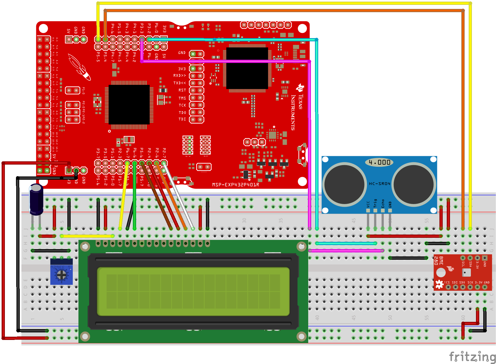

# ultrasonic_meter

An ultrasonic distance meter for the **TI MSP432P401R LaunchPad**: it measures distance with
an **HC-SR04** sensor and shows it on a **16×2 LCD** with **1 mm resolution**. Two refinements
push the accuracy and stability beyond a naïve `pulseIn` reading:

- **Temperature-compensated speed of sound** — a **BME280** reads ambient temperature and the
  firmware recomputes the speed of sound (`v = 331.3 + 0.606·T` m/s) on every cycle, instead of
  assuming a fixed value. Sound speed changes ~0.18 %/°C, so this matters at millimetre resolution.
- **Kalman filtering** — a lightweight 1-D Kalman filter smooths the noisy raw readings, with a
  10-sample moving average on top for the displayed value.



## How it works

```
HC-SR04 ──(echo pulse width)──► MSP432  ──► distance = duration · v_sound / 2
BME280  ──(temperature)───────► MSP432  ──► v_sound = 331.3 + 0.606·T
                                         ──► Kalman filter ──► 10-sample average
                                         ──► 16×2 LCD (distance + temperature)
                                         ──► serial plotter (raw / filtered / averaged)
```

1. A 15 µs trigger pulse fires the HC-SR04; `pulseIn` measures the echo's HIGH duration.
2. The BME280 temperature is read and used to compute the current speed of sound.
3. Distance in cm = `(duration · v_sound / 2) / 10000` (echo time is round-trip, hence ÷2).
4. The raw value passes through the Kalman filter; a 10-sample average is taken for display.
5. A **1 ms task-timer** (`OneMsTaskTimer`) refreshes the LCD once per second, decoupled from
   the measurement loop. Distance and temperature (°C) are shown together.

## Hardware

| Component | Role | Pins |
|---|---|---|
| TI MSP432P401R LaunchPad | ARM Cortex-M4F MCU | — |
| HC-SR04 ultrasonic sensor | Distance via echo time-of-flight | `trig` = 3, `echo` = 4 |
| BME280 | Ambient temperature (for speed-of-sound correction) | I²C (SDA/SCL) |
| 16×2 character LCD (HD44780) | Display | RS/E/D4–D7 = 35, 36, 37, 38, 39, 40 |

Full wiring is in `diagram.png` and the Fritzing project `TP3.fzz`.

## Build & flash

Built with **Energia** (the Arduino-compatible IDE/toolchain for TI LaunchPads):

1. Select board **MSP432P401R / MSP-EXP432P401R** in Energia.
2. Install the libraries: `LiquidCrystal`, `Adafruit_BME280` + `Adafruit_Sensor`, and the
   `OneMsTaskTimer` task-timer library. `Kalman.h` is included in this repo.
3. Open `distancia.ino`, compile, and upload.

### Configuration flags (top of `distancia.ino`)

| Flag | Effect |
|---|---|
| `DECIMALES` | `1` → one decimal place (mm resolution); `0` → whole centimetres |
| `PLOT` | `1` → stream raw / Kalman-filtered / averaged distance to the serial plotter (115200 baud) |

Set `PLOT 1` and open the Energia serial plotter to visualise how the Kalman filter and moving
average tame the raw sensor noise.

## Files

| File | Contents |
|---|---|
| `distancia.ino` | Main firmware: trigger/echo, temperature-compensated distance, filtering, LCD + serial output |
| `Kalman.h` | Minimal 1-D Kalman filter (single-variable low-pass) |
| `TP3.fzz` | Fritzing wiring project |
| `diagram.png` | Wiring diagram |
